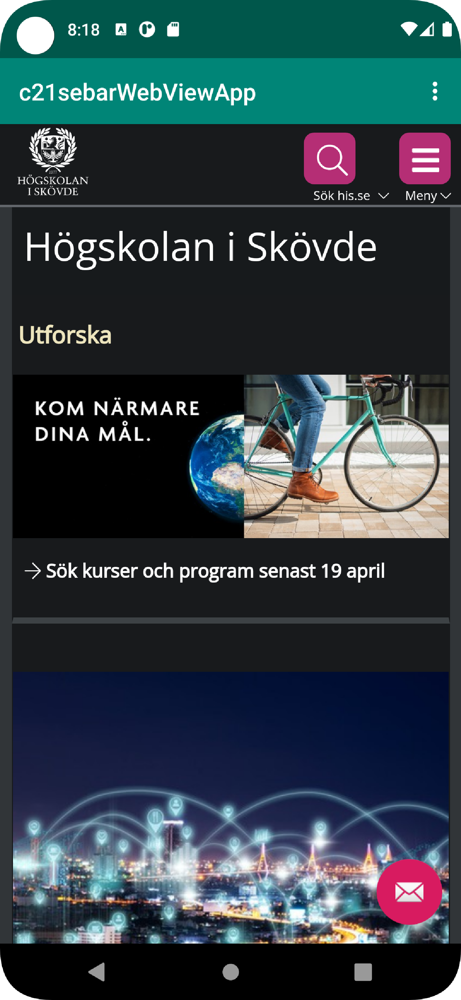
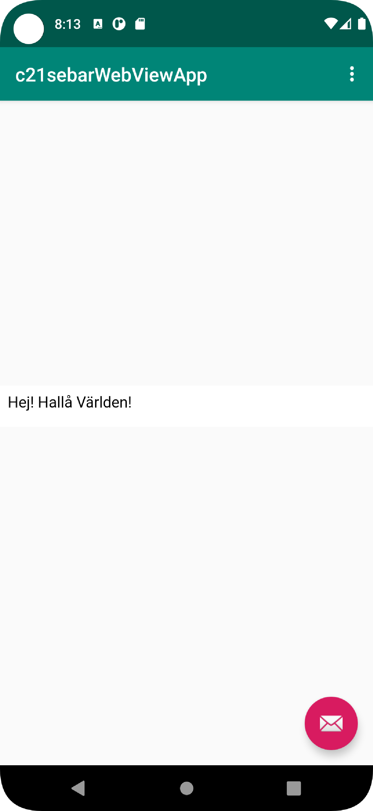

# Rapport

Forkade projektet från lenaSys
Klonade till min laptop
Bytte namn på appen `res/values/strings.xml` till c21sebarWebViewApp
Gav appen nätverksåtkomst i AndroidManifest.xml med
 ```
    <uses-permission android:name="android.permission.INTERNET" />
 ```
Skapade ett webView och satte att använda ett ClientWebView för att inte använda och öppna länkar i ett separat webbläsare som lägger sig över/öppnar nytt
Gav WebView ett id my_webView i content_main och instansierade under onCreate
Satte igång att webView fönstret får använda JavaScript
Skapade en html fil,
Laddar in extern URL när extern knappen klickas på, www.his.se
Laddar in en intern html fil när man klickar på intern knappen

```Java
        myWebView = findViewById(R.id.my_webView);
        myWebView.getSettings().setJavaScriptEnabled(true);
        myWebView.setWebViewClient(new WebViewClient());
```




